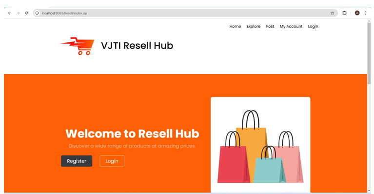
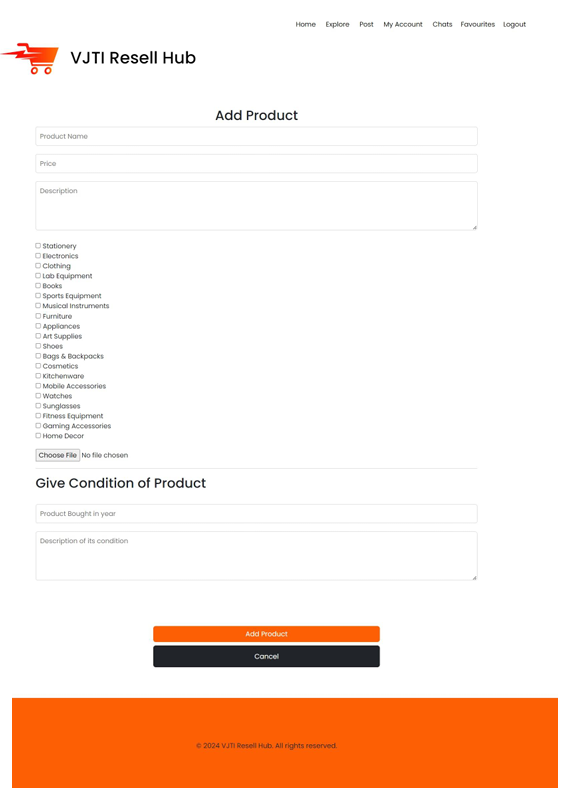
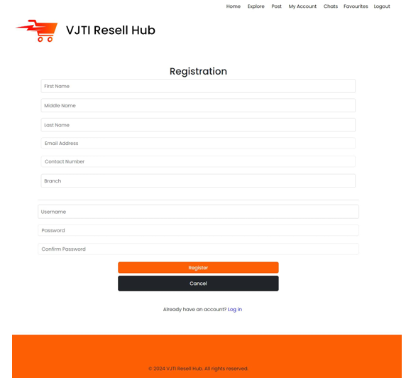
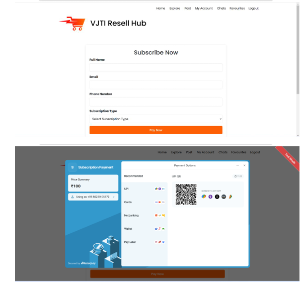
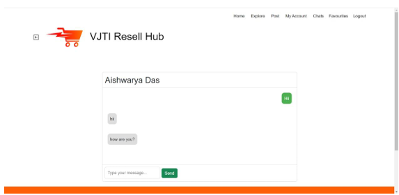
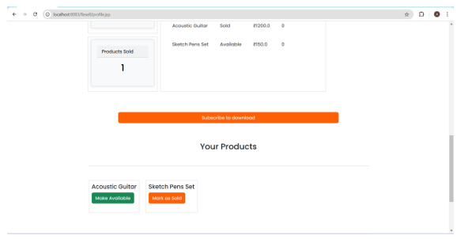
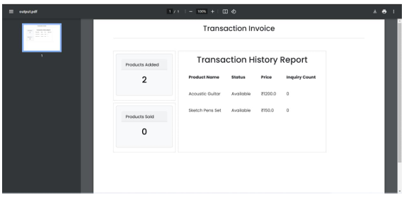
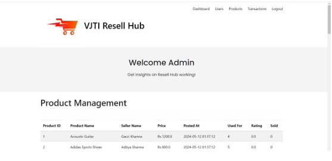

# **VJTI Resell Hub Application**

🚀 A web-based platform designed for students to buy and sell used items in a secure and easy-to-use environment.

## 📌 Features

- **User Registration 🎓**: Allows students to register and manage their profiles.
- **Add Products to Sell 🛒**: Sellers can list their products with details like name, description, price, and images.
- **Buy Products 🛍️**: Users can browse and purchase products listed by sellers.
- **Contact the Seller 📞**: Buyers can reach out to sellers via contact forms for inquiries.
- **Chat with Seller 💬**: Integrated chat functionality to facilitate real-time communication between buyers and sellers.
- **Payment Gateway Integration 💳**: Secure payment gateway for transactions between buyers and sellers.
- **Transaction Invoice Report Generation 📑**: Automatically generates an invoice report after successful transactions.

## 🛠️ Technologies Used

- **JSP**: For building dynamic web pages and forms.
- **Servlets**: For managing server-side processing and handling HTTP requests.
- **MariaDB**: For managing the database, including user profiles, product listings, and transaction data.

## 📸 Screenshots  

| Screenshot 1 | Screenshot 2 | Screenshot 3 |
|--------------|--------------|--------------|
|  |  |  |
|  |  |  |
|  |  |  |
|  |
